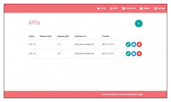
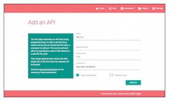
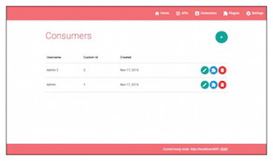
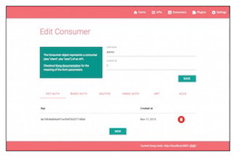
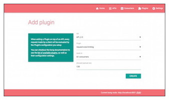

# Kong Dashboard

[**Kong**](https://getkong.org/) is a scalable, open source API Layer (also known as a API Gateway, or API Middleware).
Kong runs in front of any RESTful API and provide functionalities
and services such as requests routing, authentication, rate limiting, etc.

**Kong dashboard** is a UI tool that will let you manage your Kong Gateway setup.

## Compatibility matrix

| Kong version | Kong-Dashboard version |
|---------------------------|-----------|
| 0.6.x, 0.7.x, 0.8.x, 0.9.x| 1.x.x     |
| 0.10.x                    | 2.x.x


## Presentation

Click thumbnails to enlarge.

### Managing APIs

[](screenshots/apis_list.jpg?raw=true)
[](screenshots/api_add.jpg?raw=true)

### Managing Consumers

[](screenshots/consumers_list.jpg?raw=true)
[](screenshots/consumer_edit.jpg?raw=true)

### Managin Plugins

[](screenshots/plugins_list.jpg?raw=true)
[](screenshots/plugin_add.jpg?raw=true)

## Prerequisites

You will need:

1. a running Kong gateway. https://getkong.org/install/
2. nodejs and npm.

## Installation

### With Npm

```bash
# Install Kong Dashboard
npm install -g kong-dashboard@v2

# Start Kong Dashboard
kong-dashboard start

# To start Kong Dashboard on a custom port
kong-dashboard start -p [port]

# To start Kong Dashboard with basic auth
kong-dashboard start -a user=password

# You can set basic auth user with environment variables
# Do not set -a parameter or this will be overwritten
set kong-dashboard-name=admin && set kong-dashboard-pass=password && kong-dashboard start
```

### From sources

```bash
# Pull repository
git clone https://github.com/PGBI/kong-dashboard.git
cd kong-dashboard
git checkout 2.0

# Build Kong Dashboard
npm install
npm run build

# Start Kong Dashboard
npm start

# To start Kong Dashboard on a custom port or with basic auth
npm start -- [-p port] [-a user=password]
```

### With Docker

[](https://microbadger.com/images/pgbi/kong-dashboard "Get your own image badge on microbadger.com")

```bash
# Start Kong Dashboard
docker run -d -p 8080:8080 pgbi/kong-dashboard:v2

# Start Kong Dashboard on a custom port
docker run -d -p [port]:8080 pgbi/kong-dashboard:v2

# Start Kong Dashboard with basic auth
docker run -d -p 8080:8080 pgbi/kong-dashboard:v2 -a user=password
```


### With Vagrant

```bash
# Pull repository
git clone https://github.com/PGBI/kong-dashboard.git
cd kong-dashboard
git checkout 2.0

# Start VM
vagrant up
```
## Configuration

When browsing Kong-Dashboard, you will be asked to provide the URL of your Kong node.

If you're hosting Kong on your local machine, the "Kong node URL" is not "http://localhost:8001".
It will be your machine/LAN IP, for example: "http://192.168.x.x:8001"

## Use

You can now browse your kong dashboard at http://localhost:8080
